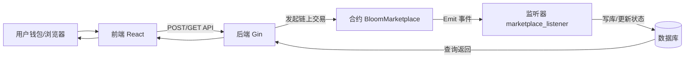

# Bloom-NFT 项目架构与合约设计文档

> 文档目标：面向开发与排障，系统性梳理整个项目的架构分层，并重点给出 NFT 市场功能（挂单、购买、出价、接受出价、撤回出价、未中标退款、Merkle 上架）的合约设计、EIP-712/签名方案、后端事件同步与前端交互细节。

---

## 1. 总体架构概览

项目由三部分协同完成：

1. `bln-contracts`：Solidity 智能合约（核心为 `BloomMarketplace`）。
2. `bln-backend`：Go + Gin 的后端服务（负责入库、链上交易发起、链上事件监听并同步状态、对前端提供 REST API）。
3. `bln-forntend`：React 前端（负责钱包连接、EIP-712 签名生成、发起后端请求、展示订单/出价状态与操作入口）。

典型数据流如下：

---

## 2. 合约 `BloomMarketplace` 设计（核心）

### 2.1 合约基本角色与资产模型

合约围绕以下关键资产运行：

1. ERC-721：NFT 资产通过 `safeTransferFrom` 由卖家托管到合约；成交后由合约转给买家。
2. `BloomToken`（BT）：作为支付/托管资产，成交支付手续费与卖家收入；出价时进行 `transferFrom(bid.buyer -> marketplace)` 形成托管。
3. 签名与哈希：使用 EIP-712 Typed Data 签名进行“离链授权 + 链上校验”，用 `listingHash` 与 `bidHash` 做唯一标识与 replay 防护。

---

### 2.2 关键事件（用于后端事件同步）

合约事件（后端监听器根据事件名与 topics/data 解析并落库）：

1. `Listed(bytes32 listingHash, address nft, address seller, uint256 tokenId, uint256 price, uint256 deadline, uint256 salt)`
2. `ListingCancelled(bytes32 listingHash, address seller)`
3. `Buy(bytes32 listingHash, address buyer)`
4. `BidPlaced(bytes32 bidhash, bytes32 listingHash, address buyer, uint256 price, uint256 deadline, uint256 salt)`
5. `BidCancelled(bytes32 bidHash, address buyer)`
6. `BidAccepted(bytes32 listingHash, bytes32 bidHash, address seller, address buyer)`
7. `BidRefunded(bytes32 bidHash, address buyer, uint256 amount)`
8. `ListingPriceReduced(bytes32 listingHash, address seller, uint256 newPrice)`

事件触发后，后端不会“直接把前端请求结果当真”，而是依赖监听器对事件进行幂等落库与状态推进（避免“交易回滚但服务端提前标记成功”的一致性问题）。

---

### 2.3 存储结构与状态含义

合约存储（摘取与市场核心功能强相关的部分）：

1. `mapping(bytes32 => bool) listings`：某个 `listingHash` 是否仍处于有效上架（尚未成交、未取消）。
2. `mapping(bytes32 => bool) sold`：某个 `listingHash` 是否已完成成交。
3. `mapping(bytes32 => address) listingSeller`：用于核验与价格/签名相关校验。
4. `mapping(bytes32 => uint256) listingOriginalPrice`：签名原价（降价后用于 digest / fee 结算相关）。
5. `mapping(bytes32 => uint256) listingPriceOverride`：降价覆盖价（有效成交价来源）。
6. `mapping(bytes32 => bool) merkleListed`：标记该 listingHash 属于 Merkle 批量上架，用于购买/接受出价时要求“空签名”。
7. `mapping(bytes32 => uint256) bidEscrow`：`bidHash -> 被托管的 BT 数量`。
8. `mapping(bytes32 => bool) bids`：某个 `bidHash` 当前是否仍处于有效托管出价（未撤回、未退款、未成交中标）。
9. `mapping(bytes32 => bytes32) winningBidByListing`：某个 `listingHash` 成交后的中标 `bidHash`，用于区分“未中标退款”。
10. `uint256 totalBidEscrow`：托管出价 BT 的累计额（用于 `withdrawFees` 可核验手续费金额不重算）。
11. `mapping(address => uint256) reductionNonces`：价格降档的签名 nonce（注意：这是“价格降档签名”的 nonce，并非列表/出价 nonce）。

---

### 2.4 EIP-712 Typed Data：Listing 与 Bid

合约继承 `EIP712("BloomMarketplace", "1")`，Typed Data 领域字段与前端必须一致：

1. `name = "BloomMarketplace"`
2. `version = "1"`
3. `chainId = 当前链 ID`
4. `verifyingContract = BloomMarketplace 合约地址`

#### Listing 类型

`Listing` 结构体（合约端）：

1. `address nft`
2. `address seller`
3. `uint256 tokenId`
4. `uint256 price`
5. `uint256 deadline`
6. `uint256 salt`

Listing typehash 对应签名字段为：

`Listing(address nft,address seller,uint256 tokenId,uint256 price,uint256 deadline,uint256 salt)`

链上 digest 计算逻辑（概念）：

1. `structHash = keccak256(abi.encode(LISTING_TYPEHASH, nft, seller, tokenId, price, deadline, salt))`
2. `listingHash = _hashTypedDataV4(structHash)`

#### Bid 类型

`Bid` 结构体（合约端）：

1. `bytes32 listingHash`
2. `address buyer`
3. `uint256 price`
4. `uint256 deadline`
5. `uint256 salt`

Bid typehash 对应签名字段为：

`Bid(bytes32 listingHash,address buyer,uint256 price,uint256 deadline,uint256 salt)`

链上 digest 计算逻辑（概念）：

1. `structHash = keccak256(abi.encode(BID_TYPEHASH, listingHash, buyer, price, deadline, salt))`
2. `bidHash = _hashTypedDataV4(structHash)`

#### 关于 nonce 与 salt（并发效率的设计点）

本项目已将 Listing/Bid 的“顺序 nonce”移除，改用随机 `salt` 来确保哈希唯一，提升同一地址并发签名与发送交易的成功率。

1. Listing/Bid 不再依赖 `nonces(address)` 做 sequential 校验。
2. 每笔挂单与每笔出价都必须带自己的 `salt`，以便 `listingHash`/`bidHash` 在链上可唯一定位对应的授权与托管。
3. 价格降档 `reduceListingPrice` 仍保留 `reductionNonces`，用于该“降价签名”的 replay protection（其目的与挂单/出价并发无关）。

---

### 2.5 合约核心方法：挂单（listWithSig/listWithMerkleProof）

#### `listWithSig(Listing listing, bytes signature)`

用途：卖家对单笔 Listing EIP-712 签名后，上链托管 NFT。

关键前置条件：

1. `listing.seller != address(0)`
2. `listing.nft != address(0)`
3. `listing.price > 0`
4. `listing.deadline >= block.timestamp`
5. `signature` 必须能恢复出 `listing.seller`

链上行为：

1. 计算 `listingHash = _verifyListingStrict(listing, signature)`。
2. `listings[listingHash]` 置为 `true`，并记录 `listingSeller/listingOriginalPrice` 等上下文。
3. `safeTransferFrom(listing.seller -> marketplace, tokenId)` 托管 NFT。
4. 发出 `Listed` 事件。

#### `listWithMerkleProof(Listing listing, bytes32[] proof, bytes32 merkleRoot, uint256 rootDeadline, bytes batchSignature)`

用途：卖家使用 Merkle 批量授权上架（前端通过本地计算 merkleRoot、批次签名 batchSignature、并为每个 token 生成 proof）。

关键校验点：

1. `MerkleProof.verify(proof, merkleRoot, leafHash)`，其中 leafHash 来源于 `ListingLeaf` 类型（包含 nft/seller/tokenId/price/deadline/salt）。
2. batchSignature 对 `BatchListing(merkleRoot, seller, rootDeadline)` 的 EIP-712 验签，恢复出 `listing.seller`。
3. 完成后 `merkleListed[listingHash] = true`。
4. 托管 NFT 并发出 `Listed` 事件。

---

### 2.6 合约核心方法：购买（buy / buyBatch）

#### `buy(Listing listing, bytes signature)`

用途：买家直接购买托管的 NFT，并结算 BT 支付（含手续费）。

要点（合约校验流程）：

1. `listing.deadline >= block.timestamp`
2. `listings[listingHash]` 为真且 `sold[listingHash]` 为假
3. `listingHash = _verifyListingForPurchase(listing, signature)`
4. `payPrice = _effectivePrice(listingHash)`（可能为链上降价覆盖价）
5. 使用 `token.transferFrom(buyer, address(this), fee)` 与 `token.transferFrom(buyer, seller, payPrice - fee)` 完成结算
6. `safeTransferFrom(address(this) -> buyer)` 转 NFT
7. 更新 `sold[listingHash]=true`、`listings[listingHash]=false`，并清理价格相关映射
8. 发出 `Buy` 事件

Merkle 路径的特殊规则：

1. 若 `merkleListed[listingHash] == true`，则要求 `signature.length == 0`，否则回退 `merkle listing: empty sig`。
2. 因此前端在 Merkle 列表时必须传入空签名（通常传 `0x`，其 bytes length 为 0）。

#### `buyBatch(Listing[] listings_, bytes[] listingSignatures)`

用途：购物车原子批量购买。

要点：

1. `n == listingSignatures.length`
2. 每笔 listing digest 用 `_listingDigest`，并要求去重（不允许重复 listingHash）
3. 对每笔调用 `_buyInternal`；其中任一笔失败则整笔回滚（原子性）。

---

### 2.7 合约核心方法：出价（bidWithSig）

#### `bidWithSig(Bid bid, bytes signature)`

用途：买家用签名授权出价，合约将 BT 托管到 `bidEscrow`。

关键校验：

1. `bid.buyer != address(0)`
2. `bid.price > 0`
3. `bid.deadline >= block.timestamp`
4. `listings[bid.listingHash]` 存在且未 sold
5. `bid.price <= _effectivePrice(bid.listingHash)`（出价不能高于当前有效挂牌价）
6. `_verifyBid(bid, signature)` 恢复地址必须等于 `bid.buyer`
7. `bids[bidHash]` 必须为 false，防止重复托管

链上行为：

1. `token.transferFrom(bid.buyer -> address(this), bid.price)` 进行托管
2. `bids[bidHash]=true`、`bidEscrow[bidHash]=bid.price`、`totalBidEscrow += bid.price`
3. 发出 `BidPlaced` 事件。

---

### 2.8 合约核心方法：撤回出价（cancelBid）与未中标退款（refundLosingBid）

#### `cancelBid(Bid bid)`

用途：出价者在 listing 未成交前撤回托管。

关键点：

1. 由合约根据 `bid` 的字段计算 `bidHash`（不依赖 `bidSignature` 参数）。
2. 需要 `msg.sender == bid.buyer`
3. 需要 `!sold[bid.listingHash]`（成交后禁止该原始撤回路径）
4. 需要 `bids[bidHash]==true` 且 `bidEscrow[bidHash] > 0`

链上行为：

1. 清理 `bids` 与 `bidEscrow`，同步减少 `totalBidEscrow`
2. `token.transfer(bid.buyer, escrowAmount)` 退回 BT
3. 发出 `BidCancelled` 事件。

前端 UI 显示建议（见第 4 部分“撤回出价”按钮策略）：在“挂单进行中 + 出价进行中”时展示撤回按钮。

#### `refundLosingBid(Bid bid, bytes bidSignature)`

用途：listing 已成交后，未中标的出价者取回托管。

关键点：

1. 需要用 `_verifyBid(bid, bidSignature)` 验签，恢复出价者身份。
2. `sold[bid.listingHash]` 必须为 true
3. 若 `winningBidByListing[bid.listingHash] != bytes32(0)`，则需确保 `bidHash != winner`
4. 需要 `bids[bidHash]==true` 且 escrowAmount > 0
5. 需要 `msg.sender == bid.buyer`

链上行为：

1. 清理 `bids` 与 `bidEscrow`、减少 `totalBidEscrow`
2. `token.transfer(bid.buyer, escrowAmount)` 退回 BT
3. 发出 `BidRefunded` 事件。

---

### 2.9 合约核心方法：接受出价（acceptBid）

#### `acceptBid(Listing listing, bytes listingSignature, Bid bid, bytes bidSignature)`

用途：卖家接受某笔出价并完成成交。

关键校验：

1. `listing.deadline >= block.timestamp`
2. `bid.deadline >= block.timestamp`
3. `listing.seller != bid.buyer`
4. `listingHash = _verifyListingForPurchase(listing, listingSignature)`
   - Merkle listing 时要求 `listingSignature.length == 0`
   - 非 Merkle listing 时要求签名可恢复 `listing.seller`
5. `bidHash = _verifyBid(bid, bidSignature)`
6. `listings[listingHash]==true` 且 `!sold[listingHash]`
7. `bids[bidHash]==true`
8. `bid.listingHash == listingHash`
9. `bidEscrow[bidHash] == bid.price`（防止出价字段与托管金额不一致）

链上结算与状态推进：

1. `winningBidByListing[listingHash] = bidHash`
2. `fee = bid.price * feeRate / feePrecision`
3. `token.transfer(listing.seller, bid.price - fee)`
4. `safeTransferFrom(address(this) -> bid.buyer)` 转 NFT
5. `sold[listingHash]=true`、`listings[listingHash]=false`、清理 bid 托管与价格映射
6. 发出 `BidAccepted` 事件。

前端/后端实现细节强调“原价 price”的一致性：

1. 当卖家进行过 `reduceListingPrice`，DB 中显示的“当前价”会变化，但签名 digest 与 cancel/accept/buy 的 `listing.price` 必须使用 `listingOriginalPrice(listingHash)` 返回的“原价”。
2. 前端在买与取消批量上架时会读取 `listingOriginalPrice`，并把该值塞回 `Listing.price` 字段。

---

### 2.10 价格降档（reduceListingPrice）

函数：

1. `reduceListingPrice(bytes32 listingHash_, address seller, uint256 newPrice, uint256 nonce, bytes calldata signature)`

设计目的：

1. 签名降价 replay protection：仍使用 `reductionNonces[seller]` 做递增 nonce 防重放。
2. 链上存储 `listingPriceOverride[listingHash_] = newPrice`，成交时使用 `_effectivePrice` 取覆盖价。

前端实现策略（在 `Profile.tsx` 内）：

1. 降价不取消上架，不会触发 cancelListing。
2. 降价需要 EIP-712 签名，签名内容携带 `nonce`（由合约侧计数器约束）。

---

## 3. 后端 Go 架构设计（Gin + 服务层 + 仓储层 + 事件监听）

### 3.1 分层结构

后端核心目录（以当前项目命名为准）：

1. `bln-backend/router/router.go`：路由注册（统一 `/api` 前缀）。
2. `bln-backend/api/handler/*`：HTTP 处理层，把请求参数映射为 service 调用。
3. `bln-backend/services/nft_orders_service.go`：业务编排层（创建挂单/出价、接受出价、状态校验）。
4. `bln-backend/repository/nft_orders_repository.go`：数据库访问（GORM 查询与插入）。
5. `bln-backend/listener/marketplace_listener.go`：合约事件监听与落库更新状态。
6. `bln-backend/listener/marketplace_expiration_worker.go`：定时扫描数据库 deadline，把 `Pending -> Expired`（不与合约交互，仅更新 DB 状态）。
7. `bln-backend/utils/bloom_marketplace.go`：链上调用封装（发送交易、签名参数组装、Merkle 空签名处理等）。

### 3.2 REST API（与市场功能直接相关的端点）

路由注册（`/api` 前缀）中与市场订单强相关的入口：

1. `GET /api/order/orderlist?status=&nftId=`：挂单列表（由 `entry_orders.status` 过滤）。
2. `POST /api/order/entryorders`：单笔挂单（EIP-712 Listing 签名提交）。
3. `POST /api/order/entryorders/batch`：Merkle 批量挂单（Root + batchSignature + 每笔 proof）。
4. `POST /api/order/bidplaced`：提交出价（EIP-712 Bid 签名提交）。
5. `POST /api/order/bidaccepted`：卖家接受出价并完成成交（由服务端代签/组装链上入参）。
6. `GET /api/order/bidlist/:ordersId`：某挂单下出价列表。
7. `GET /api/order/my-entryorders`：我的挂单历史。
8. `GET /api/order/my-bids`：我的出价历史。

### 3.3 业务流程：挂单/出价/接受出价（后端服务层）

#### 挂单（单笔）

前端提交 `EntryOrdersRequest`（后端在 `nft_orders_service.go:EntryOrders`）：

1. 入库 `entry_orders`：`status = enums.ListingReady`（未上链前）。
2. 在入库成功后，发起链上交易 `listWithSig`（由 `utils.ListWithSigOnChain` 负责组装 Listing 参数并调用合约）。
3. 若链上失败，当前代码采用“best-effort”把该条记录标记为 `ListingCancelled`（但最终链上状态仍应以监听器事件为准）。

#### 挂单（Merkle 批量）

前端提交 `BatchEntryOrdersRequest`：

1. 后端逐笔入库每个叶子对应的 `entry_orders`：
   - `IsMerkle = true`
   - `Signature = BatchSignature`（注意：此处存储的是批次根签名，用于合约 `listWithMerkleProof` 的 batchSignature 参数）
2. 后端对每一笔调用 `utils.ListWithMerkleProofOnChain`，发起 `listWithMerkleProof`。

#### 出价

前端提交 `BidPlacedRequest`：

1. 后端校验：挂单必须处于 `ListingPending`。
2. 入库 `bid_placed`：`status = enums.BidReady`。
3. 链上调用 `bidWithSig(bid, sig)`：
   - 合约身份校验依赖 `_verifyBid`：从签名恢复出的地址必须等于 `bid.buyer`；同时合约会执行 `token.transferFrom(bid.buyer -> address(this), bid.price)`，因此出价者必须已对 `marketplace` 授权 BT 托管。`msg.sender` 本身不参与该身份校验。
4. 监听器收到 `BidPlaced` 事件后把该 bid 置为 `BidPending` 并写链上映射。

#### 接受出价（bidaccepted）

前端提交 `BidAcceptedRequest`：

后端服务 `BidAccepted` 做关键校验：

1. `bid` 与 `entry` 存在且状态符合要求：
   - listing 必须是 `ListingPending`
   - bid 必须是 `BidPending`
2. `seller mismatch`：只允许挂单卖家接受。
3. 调用 `utils.AcceptBidOnChain` 发起 `acceptBid`：
   - 对于 Merkle listing，必须传入 `listingSignature = []byte{}`（空 bytes），避免合约回退 `merkle listing: empty sig`。
   - `Listing.price` 必须使用合约侧 `listingOriginalPrice(listingHash)`，保证 digest 与签名一致性。

### 3.4 链上事件监听与幂等

监听器机制：

1. 使用 `chain_event_cursor` 记录已处理到的区块高度（断点续跑）。
2. 使用 `chain_event_log` 记录（`txHash + logIndex`）以实现事件幂等处理。
3. 每个事件 handler（如 `onListed/onBidPlaced/onBidAccepted/onBidCancelled/onBidRefunded/onBuy/onListingCancelled/onListingPriceReduced`）更新 DB 中 `entry_orders` / `bid_placed` / `nft_list`。

与市场强相关的状态推进（与当前监听器实现对齐）：

1. `Listed`：把对应 `entry_orders.status -> ListingPending`，并写 `listingHash -> entry_orders.id` 映射。
2. `BidPlaced`：把对应 `bid_placed.status -> BidPending`，并写 `bidHash -> bid_placed.id` 映射。
3. `BidCancelled`：把对应 `bid_placed.status -> BidCancelled`。
4. `BidAccepted`：
   - `entry_orders.status -> ListingCompleted`，写 buyer
   - 中标 bid：`BidCompleted`
   - 同一 listing 下其它 pending bids：`BidOutbid`
   - 同步 `nft_list.owner`
5. `BidRefunded`：`bid_placed.status -> BidRefunded`
6. `Buy`（直购）：
   - `entry_orders.status -> ListingCompleted`
   - 同一 listing 下仍 pending 的 bids：全部置为 `BidOutbid`（后续由买家走 refundLosingBid）
7. `ListingCancelled`：
   - `entry_orders.status -> ListingCancelled`
   - 并将该单下 pending bids 置为 `BidDelisted`（提示前端：这些 bids 取回路径不再依赖 acceptBid，中间态会走撤回/退款策略）。

8. `marketplace_expiration_worker`（链下）：
   - `entry_orders.status=ListingPending && deadline<=now`：置为 `ListingExpired`
   - `bid_placed.status=BidPending && (bid.deadline<=now || entry.deadline<=now)`：置为 `BidExpired`

---

## 4. 前端 React 交互与签名/状态细节

### 4.1 页面职责

1. `src/pages/Market.tsx`：市场挂单列表 + 出价提交 + 购物车批量购买 +（挂单详情对话框内）出价列表、撤回出价、取回托管。
2. `src/pages/Profile.tsx`：用户资产、挂单/批量 Merkle 上架、取消上架、接受出价、查看历史订单/出价记录与从历史取回托管。

### 4.2 出价与撤回（重点）

#### 出价提交（bidWithSig）

前端在 `Market.tsx` 的 `handleSubmitBid`：

1. 从 `orders` 中拿到链上 `listingHash`。
2. 使用 `signer.signTypedData` 生成 `Bid` 签名，typed data 字段严格为：
   - `listingHash: bytes32`
   - `buyer: address`
   - `price: uint256`
   - `deadline: uint256`
   - `salt: uint256`
3. `salt` 使用随机数生成（`randomBytes(32)` -> `BigInt(hexlify(...))`），用于确保 bidHash 唯一。
4. 通过后端 `POST /api/order/bidplaced` 把 typed signature 与 bid 参数发给服务端。

#### 撤回出价（cancelBid）

前端展示规则（`Market.tsx`）：

1. 当“挂单状态”和“出价状态”都处于进行中时（即 `detailOrder.status === 1` 且该 bid 的 `status === 1`），显示“撤回出价”按钮。
2. 点击按钮后只允许 `bid.buyer == account` 的本人操作。

执行链上：

1. 构造 `bidStruct = { listingHash, buyer, price, deadline, salt }`
2. 调用 `mp.cancelBid(bidStruct)`

合约侧无需 bidSignature，因为 cancelBid 根据字段重算 bidHash 并校验 `msg.sender == bid.buyer`。

#### 取回托管（cancelBid vs refundLosingBid）

当用户在历史或详情中要取回某笔托管：

1. 前端会读取 `mp.sold(listingHash)` 判断该 listing 是否已成交。
2. 若未成交：走 `cancelBid(bidStruct)`。
3. 若已成交：走 `refundLosingBid(bidStruct, bidSignature)`，此时需要当初提交出价时的 bid EIP-712 signature。

### 4.3 购买与接受出价时的“空签名规则（Merkle）”与“原价一致性”

1. Merkle listing：购买/acceptBid 要传入 `listingSignature` 为空 bytes（前端通常传 `0x`，bytes length 为 0）。
2. price reduction 后：`Listing.price` 必须用 `listingOriginalPrice(listingHash)`，而不是 DB 中的当前有效价，以保证 listing digest 与签名一致。

---

## 5. 状态枚举与状态流转（建议作为接口契约使用）

后端分别为 Listing 与 Bid 定义独立状态枚举（便于前端清晰展示与过滤）。

ListingStatus（`entry_orders.status`）：

1. `0` 准备中（未上链）
2. `1` 进行中（已上链 Listed，且未 sold）
3. `2` 已成交（Buy 或 BidAccepted）
4. `3` 已过期（deadline 到期后由后端过期扫描 worker 自动推进为 Expired；合约托管资产仍需由卖家/买家发起取回交易）
5. `4` 已取消（卖家取消/上链失败等）

BidStatus（`bid_placed.status`）：

1. `0` 准备中（入库未上链）
2. `1` 进行中（BidPlaced 事件确认后）
3. `2` 已成交（BidAccepted 中标）
4. `3` 已过期（deadline 到期后由后端过期扫描 worker 自动推进为 Expired）
5. `4` 取消出价（cancelBid / 上链失败等）
6. `5` 已下架（挂单被取消后，该出价的“进行中”语义被置为 delisted）
7. `6` 未中标（直购/接受其它 bid 后，该笔变为 outbid，之后可退款）
8. `7` 已退款（refundLosingBid 完成）

---

## 6. 安全性与并发方案说明

### 6.1 为什么移除了 Listing/Bid nonces？

原先 sequential nonce 的设计会带来“同一 buyer/seller 并发发签名/发交易时，后续交易在链上执行顺序未满足时可能失败”的问题（表现为 `bad nonce` 回退）。

本项目选择：

1. 移除合约中的 sequential nonce 校验。
2. 通过随机 `salt` 进入 EIP-712 digest，从而让每个 listing/bid 的 hash 天然唯一。

并发收益：

1. 用户可同时对多个 listing/bid 发起交易签名与提交。
2. 不依赖链上计数器的确认顺序。

### 6.2 Replay 防护仍然存在吗？

存在。Replay 防护转移为：

1. listingHash/bidHash 基于 signed typed data + salt 唯一化。
2. 合约仍通过 `bids[bidHash]`、`listings[listingHash]` 以及 sold 标记避免重复或无效状态回放。
3. 价格降档仍保留 `reductionNonces`。

---

## 7. 未来扩展点（可选）

如果需要继续增强产品体验与一致性，可以考虑：

1. 将链上交易提交后的 DB optimistic 标记改为“只写链上事件”，进一步简化一致性边界。
2. 为 batch buy / batch cancel 增加更细粒度的前端校验与拆分重试策略。
